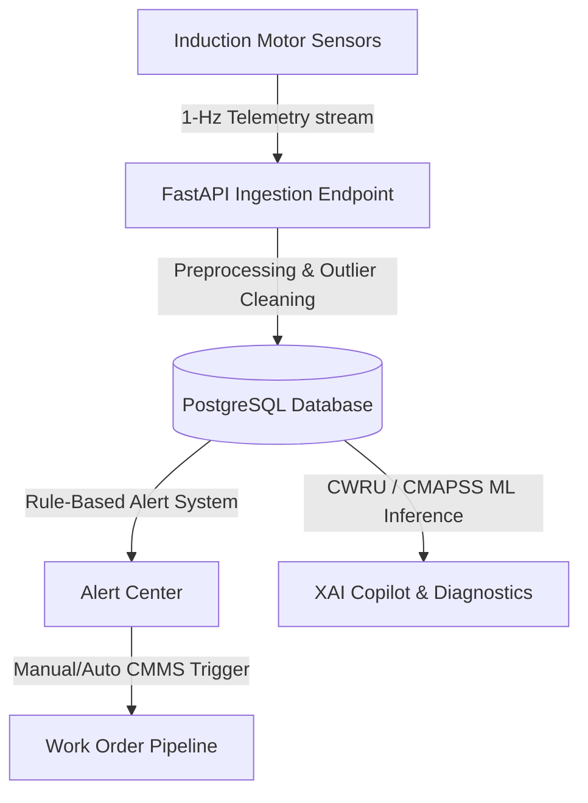

# Project ASTRA | On-Premise Predictive Maintenance System

Project ASTRA is a production-grade, on-premise predictive maintenance system designed specifically for induction motors. The platform combines real-time database ingestion, rule-based alarm engines, advanced machine learning classifiers, and Explainable AI (XAI) to monitor machine health and predict failures before they happen.

---

## ⚙️ System Architecture

Project ASTRA connects physical sensor telemetry from the factory floor to an on-premise dashboard through a robust PostgreSQL database pipeline:



---

## 📂 Project Structure

- `dashboard/` — Frontend web application built with HTML, Tailwind CSS, and Vanilla JavaScript.
- `ml/` — Machine Learning backend.
- `ml/data/` — Holds the raw CSV seed data.
- `ml/src/api/` — Backend FastAPI server scripts:
  - [main.py](file:///c:/Users/rasyaad/Downloads/PredictaGuard-main/PredictaGuard-main/ml/src/api/main.py) — REST API endpoints, routing, and server startup.
  - [db_manager.py](file:///c:/Users/rasyaad/Downloads/PredictaGuard-main/PredictaGuard-main/ml/src/api/db_manager.py) — Database management, cleaning pipelines, and seeding logic.
  - [predictor.py](file:///c:/Users/rasyaad/Downloads/PredictaGuard-main/PredictaGuard-main/ml/src/api/predictor.py) — Model inference routing and dynamic XAI generation.
  - [simulator.py](file:///c:/Users/rasyaad/Downloads/PredictaGuard-main/PredictaGuard-main/ml/src/api/simulator.py) — Rule engines and background data loop simulation.
  - [notifier.py](file:///c:/Users/rasyaad/Downloads/PredictaGuard-main/PredictaGuard-main/ml/src/api/notifier.py) — SMTP Email & Twilio WhatsApp notification handler.
- `ml/src/models/` — Machine learning training pipelines and mathematical scaling rules.

---

## 🌟 Recent System Enhancements (Version 2.0)

We have upgraded Project ASTRA with key enterprise-grade security and planning features:

### 1. 🔐 Role-Based & Clearance-Based Access Control
* **Unified Security Clearance levels**:
  * **Level 4** (Super Admin): Full administrative credentials and notification gateway edits.
  * **Level 3** (Admin): Machine predictions, reporting modules.
  * **Level 2** (Maintenance Specialist): Equipment details, work order planning, maintenance CRUD.
  * **Level 1** (Operator): Overview status dashboard, basic support.
* **Pre-seeded Accounts**:
  * `superadmin@ASTRA.com` / `rasyaad@ASTRA.com` (Super Admin - Level 4)
  * `admin@ASTRA.com` (Admin - Level 3)
  * `maint@ASTRA.com` (Maintenance - Level 2)
  * `operator@ASTRA.com` (Operator - Level 1)
* **Dynamic Guards**: Users without correct clearance are blocked from protected routes and forbidden navigation options are hidden from the sidebar layout.

### 2. 📋 Work Orders CRUD & Technician Assignment
* Added a dedicated sub-maintenance CRUD console ([maintenance_crud.html](file:///c:/Users/rasyaad/Downloads/PredictaGuard-main/PredictaGuard-main/dashboard/maintenance_crud.html)).
* Support for technician assignment during work order creation:
  * Select from active specialist staff (`J. Sutherland`, `M. Rossi`, `S. O'Brien`, `H. Tanaka`).
  * Table rows dynamically render the assigned technician along with their profile avatar directly from database parameters.

### 3. 🌡️ Automated Safety Watchdog & Notifications
* Integrated a telemetry watchdog that scans incoming sensor streams (and simulator runs) for safety envelope violations:
  * Temperature limits: **140°C**
  * Vibration limits: **8.0 mm/s**
  * Current limits: **15.0 A**
* On breach, notifications are automatically dispatched in the background to target floor contacts via **Email (SMTP)** and **WhatsApp (Twilio)**.

### 4. 👤 Editable Account Profile Settings
* Refactored the profile settings interface to support editing full name, job title, email, and custom avatar URL.
* Changes are persisted to the database and update the live dashboard session state dynamically.

### 5. 🔒 Git Credentials Isolation
* Created `ml/src/api/local_config.py` (which is in `.gitignore`) to house local secrets. The system loads local overrides when running locally, keeping your production git commits completely clean.

---

## 💾 Database Ingestion & Data Quality Pipeline

ASTRA utilizes a local PostgreSQL database running on `localhost:5432` (`postgres` database).

### 1. Auto-Ingestion & Seeding
On server boot, `db_manager.py` checks if the telemetry table is empty. If empty, it automatically extracts and seeds the last 100 entries of the historical machine CSVs (e.g. `pump_data.csv`, `mixer_data.csv`).

### 2. Preprocessing & Data Cleaning
Before saving any sensor telemetry to the database, the record is processed through an automated cleaning pipeline:
- **Null Imputation (Forward-Fill):** Missing sensor values are automatically replaced with the last known stable state of that machine to prevent telemetry dropouts.
- **Outlier Clipping:** Out-of-bounds anomalies are clipped to physical motor safety constraints (e.g., vibration limited to `12.0 mm/s` and temperature capped at `160°C`).

---

## 🚀 How to Run the System

### Step 1: Initialize Local Config
Create a file named `ml/src/api/local_config.py` to specify your database passwords and Twilio configurations:
```python
import os
os.environ["ASTRA_DB_PASSWORD"] = "your_postgres_password"
os.environ["ASTRA_DB_USER"] = "postgres"
```

### Step 2: Install Dependencies
Run in your virtual environment:
```bash
pip install -r ml/requirements.txt
```

### Step 3: Launch
1. Double-click the **`run_dashboard.bat`** file in the root directory.
2. Once the command window indicates that the server is ready, open **`http://localhost:8000`** in your browser.
3. Access the **DB Simulation** tab from the sidebar to inject manual records, or view live predictions on the **Overview** dashboard!
