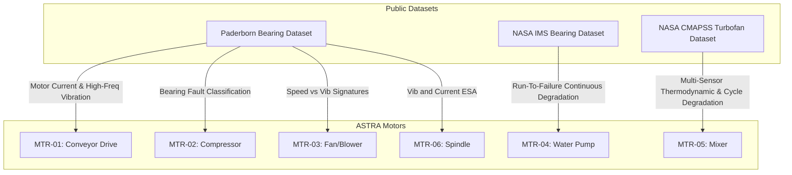
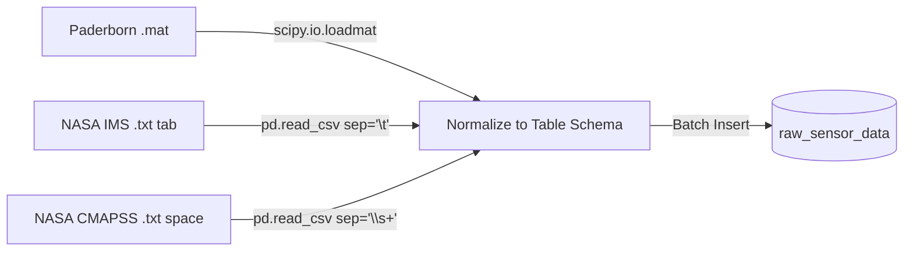
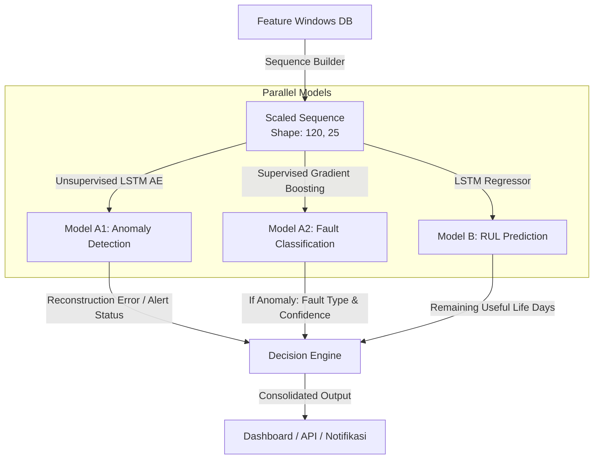

# 🛡️ Project ASTRA: PredictaGuard Technical Presentation Materials
## Presentation Deck & Technical Reference Guide (Master Copy)

---

## 1. Opening — Problem & Objective

### 📌 Background & Urgency
In large-scale manufacturing industries (such as milk pasteurization, powder drying, and food packaging at Kerry Group), machine reliability is everything.
* **Uptime** is the key business sustainability metric: sudden production line stoppages interrupt the flow of time-sensitive raw materials (such as raw milk) that risk contamination.
* **Reactive & Time-based Maintenance Cost**: Currently, maintenance is still performed based on calendar schedules (e.g., periodic servicing every 3 months) or reactively when the machine has already broken down.
  * According to industrial data, emergency repair costs are on average **3x more expensive** than planned preventive maintenance.
  * Operational losses due to unplanned downtime range between **USD 100,000 and USD 500,000 per incident** if it occurs on critical pasteurization machines (Critical Control Point - CCP).

### 🔴 Problem Statement
1. **Zero Predictive Capability**: The ASTRA factory has **6 critical machines** (Conveyor Drive, Compressor, Fan/Blower, Water Pump, Mixer, and Spindle) operating 24/7 without a predictive health monitoring system.
2. **Silent Degradation**: Bearings and electrical components of the motors undergo slow microscopic wear without early detection until they eventually seize completely (catastrophic failure).
3. **Data Silo**: Basic telemetry data from field sensors (temperature, vibration, motor current) is already flowing but is only stored in local storage without being processed into predictive insights that can be trusted by technicians on the floor (human trust gap).

### 🎯 Objective
Build **PredictaGuard**, an integrated on-premise monitoring system capable of performing:
1. **Real-Time Anomaly Detection**: Identifying abnormal machine behavior from its historical healthy patterns.
2. **Fault Classification**: Determining the specific type of failure (e.g., inner race defect, outer race defect, roller element fault, or motor overload).
3. **Remaining Useful Life (RUL) Prediction**: Estimating the remaining safe operating time of the machine before critical failure occurs, complete with severity estimations and operational action recommendations.

### 🔍 Scope
* **Monitored Assets**: 6 critical machines with IDs `MTR-01` to `MTR-06`.
* **Simulation Datasets**: Leveraging 3 world-class public datasets to model motor fault behaviors: **Paderborn Bearing Dataset**, **NASA IMS Bearing Dataset**, and **NASA CMAPSS Turbofan Dataset**.

---

## 2. Data Architecture

### 📊 Mapping 6 Machines to 3 Public Datasets
To train models that represent the real physical conditions of the 6 ASTRA machines, we map the sensor telemetry to public datasets with the most appropriate failure characteristics:



#### **Mapping Rationale (Key Presentation Points):**
1. **Paderborn Bearing Dataset (Mapped to Conveyor, Compressor, Fan, Spindle):**
   * *Rationale:* This dataset records high-frequency vibration along with motor electrical current simultaneously on induction motors. This is highly suitable for machines experiencing high mechanical load variations (such as Conveyors and Compressors) because it enables the analysis of bearing damage signs directly from motor current fluctuations (Motor Current Signature Analysis - MCSA) and vibration acceleration.
2. **NASA IMS Bearing Dataset (Mapped to Water Pump - MTR-04):**
   * *Rationale:* Industrial water pumps generally undergo slow degradation due to fluid erosion, cavitation, or gradual bearing wear. The IMS dataset records continuous bearing degradation over several weeks until complete breakdown (run-to-failure), which is ideal for detecting slow-onset degradation in pumps.
3. **NASA CMAPSS Turbofan Dataset (Mapped to Mixer - MTR-05):**
   * *Rationale:* Dough/liquid mixers have varying thermal and mechanical load patterns depending on product viscosity. CMAPSS provides multi-sensor data (HPC outlet temperature, pressure, bypass ratio) showing gradual efficiency decline over operational cycles. This thermal/speed efficiency degradation is modeled as a proxy for mixer blade degradation or clogging due to thick residues (fouling).

### 🗄️ PostgreSQL Database Structure
The database schema is designed to house raw telemetry, operational context, extracted features, and AI analysis results in a modular way:

1. **`motors`**: Stores basic motor specifications, safe physical limits, nominal power, and modeling data sources.
2. **`raw_sensor_data`**: A container table for real-time raw sensor data directly from the machines/simulator before cleaning.
3. **`production_context`**: Stores external context (work shifts, production load levels: *low*, *normal*, *high*, and room ambient temperature).
4. **`feature_windows`**: Stores statistical and spectral features extracted from 30-second windows.
5. **`prediction_results`**: Stores the inference outputs of the 3 parallel models, severity levels, and XAI explanations (SHAP contributions).

```
[REAL FACTORY CONDITION]
Raw Sensor Telemetry ──> Inserted into raw_sensor_data (AS-IS WITHOUT CLEANING)
                                  │
                                  ▼
                     [CLEANING & ENGINEERING PIPELINE]
                      (Dirty data cleaned in memory)
                                  │
                                  ▼
                Structured Ingestion to feature_windows
```
> [!IMPORTANT]
> **Why does raw data enter without cleaning first?**
> This is done intentionally to simulate real factory floor conditions. In the real world, sensors often experience dropouts, packet loss, voltage glitches, or environmental noise. Saving raw data without cleaning guarantees the authenticity of the historical audit trail and provides a testbed for the robustness of our automated cleaning pipeline at the processing memory level.

---

## 3. Data Pipeline (ETL/Ingestion)

### 🔄 Multi-Format Ingestion Flow
The PredictaGuard system must handle different formats from the 3 public datasets used in the simulation:
* **Paderborn:** Binary matrix `.mat` (MATLAB) format containing high-frequency vibration arrays (up to 64kHz) and electrical current.
* **NASA IMS:** A collection of tab-separated text files (`.txt tab`) without headers, written every 10 minutes containing 20,480 vibration readings per file.
* **NASA CMAPSS:** Space-separated text files (`.txt space`) containing run-to-failure cycles with 26 headerless sensor columns.

All these formats are dynamically read and normalized to a uniform table schema in PostgreSQL:



### 💻 Transformation & Normalization Snippets
Representative ingestion script examples from [load_paderborn.py](file:///c:/Users/rasyaad/Downloads/PredictaGuard-main/PredictaGuard-main/scripts/load_paderborn.py) and [load_cmapss.py](file:///c:/Users/rasyaad/Downloads/PredictaGuard-main/PredictaGuard-main/scripts/load_cmapss.py):

```python
# 1. Parsing Paderborn MATLAB (.mat) File
import scipy.io
import pandas as pd

def parse_paderborn_mat(filepath, motor_id):
    mat = scipy.io.loadmat(filepath)
    # Find the primary data struct key
    data_key = [k for k in mat.keys() if not k.startswith('__')][0]
    struct = mat[data_key][0, 0]
    
    # Extract vibration and current from the MATLAB struct
    vibration = struct['Vibration_Signal'][0, 0]['Data'].flatten()
    current = struct['Phase_Current'][0, 0]['Data'].flatten()
    
    length = min(100000, len(vibration)) # Truncate to save DB space
    df = pd.DataFrame({
        'motor_id': motor_id,
        'recorded_at': pd.date_range('2024-01-01', periods=length, freq='15.6ms'),
        'vibration_x': vibration[:length],
        'current_a': current[:length],
        'data_source': 'paderborn',
        'is_simulated': False
    })
    return df

# 2. Parsing NASA CMAPSS Space-Separated (.txt space) File
def parse_cmapss_txt(filepath, motor_id):
    cols = ['engine_id', 'cycle', 'setting1', 'setting2', 'setting3'] + [f's{i}' for i in range(1, 22)]
    df = pd.read_csv(filepath, sep=r'\s+', header=None, names=cols)
    
    # Filter only a few engines
    df = df[df['engine_id'] <= 5].copy()
    
    # Map parameters to the general schema
    df['motor_id'] = motor_id
    df['recorded_at'] = pd.date_range('2024-03-01', periods=len(df), freq='30s')
    df['temperature'] = df['s2'] # Sensor 2 = HPC Outlet Temperature
    df['rpm'] = df['s11']         # Sensor 11 = Core Physical Speed
    df['current_a'] = df['s12']   # Sensor 12 = Motor Current (Proxy)
    df['vibration_x'] = df['s6']  # Sensor 6 = Vibration (Proxy)
    df['torque_nm'] = df['s13']   # Sensor 13 = Torque
    return df[['motor_id', 'recorded_at', 'temperature', 'vibration_x', 'current_a', 'rpm', 'torque_nm']]
```

---

## 4. Cleaning & Feature Engineering Pipeline

PredictaGuard implements a **periodic automated process every 30 seconds** to fetch the latest raw data from `raw_sensor_data`, perform cleaning, and engineer features before storing them in the `feature_windows` table.

### 🧼 Processing Dirty Data (5 Handled Data Problems)
Cleaning is performed at the [cleaning.py](file:///c:/Users/rasyaad/Downloads/PredictaGuard-main/PredictaGuard-main/ml/src/pipeline/cleaning.py) level with the following algorithm:

```
[RAW TELEMETRY WINDOW (30s)]
             │
             ▼
1. Remove Timestamp Duplicates ──> df.drop_duplicates(subset=['recorded_at'])
             │
             ▼
2. Outlier/Physical Clipping   ──> Values outside physical boundaries set to NULL
             │
             ▼
3. Adaptive Gap Imputation     ──> <30% Null: Linear Interpolation (limit=3)
                                   30%-70% Null: Last Value Forward Fill (limit=5)
                                   >70% Null: Leave NULL (Sensor Disconnected)
             │
             ▼
4. Time Synchronization        ──> Rounds timestamp to nearest second (round('1s'))
             │
             ▼
5. Butterworth Low-Pass        ──> Reduces high-frequency vibration sensor noise
             │
             ▼
   [CLEAN TELEMETRY WINDOW]
```

* **Physical Limit Thresholds:**
  * Temperature: `0.0°C` to `200.0°C` (Temperatures above `200°C` are flagged as sensor errors).
  * Vibration: `-50.0 mm/s` to `50.0 mm/s`
  * Motor Current: `0.0 A` to `100.0 A`
* **Butterworth Low-pass Filter (4th Order, Cutoff 10% of Nyquist frequency):**
  * Useful for filtering out high-frequency electromagnetic interference (EMI) spikes in the factory environment without altering the underlying vibration signal of the machine.

---

### ⚙️ Feature Engineering (30-Second Raw Telemetry ──> 1 Feature Row)
From a 30-second raw telemetry window (containing hundreds to thousands of data points), the system extracts statistics into **25 summary features** grouped into 3 main domains:

| Domain | Feature Name | Mathematical Description & Rationale |
|---|---|---|
| **Statistical Features** | `temp_mean`, `temp_max`, `temp_min`, `temp_slope`, `temp_std`, `current_mean`, `current_slope`, `rpm_mean`, `torque_mean` | *Mean* and *Std Dev* represent shifts in baseline load. *Slope* (obtained via 1st-order linear polynomial fitting) captures linear heating trends of the motor that indicate abnormal friction. |
| **Signal-based Features** | `vib_rms`, `vib_peak`, `vib_kurtosis`, `vib_skewness`, `vib_crest`, `vib_fft_low`, `vib_fft_high`, `current_thd` | **RMS** represents the total vibration energy. **Kurtosis** is sensitive to sharp impulsive spikes caused by microscopic bearing cracks. **Crest Factor** (Peak/RMS) detects repeating mechanical impacts. **FFT** splits low-frequency energy (misalignment/unbalance issues) vs high-frequency energy (early bearing degradation). |
| **Cross-parameter Features** | `load_ratio`, `temp_per_load`, `power_estimate` | Combines mechanical & electrical parameters: **Load Ratio** (`current_mean / rpm_mean`), **Temp per Load** (`temp_mean / current_mean`), and **Power Estimate** (`rpm_mean * torque_mean`) to monitor motor efficiency anomalies. |

#### **💡 Domain Knowledge Highlights (Key Q&A Points):**
1. **Why is Kurtosis extremely important for Bearing Faults?**
   * *Answer:* In the early stages of bearing degradation (e.g., small cracks on a steel ball), the vibration signal is dominated by very sharp, short-duration periodic impact impulses. The average vibration energy (RMS) does not change much initially, but **Kurtosis** (the peakedness of the data distribution) spikes sharply past the normal healthy threshold (Kurtosis > 3). This provides early warnings *weeks before failure*.
2. **Why is the Cross-Parameter Feature crucial for Multi-Parameter Detection?**
   * *Answer:* If we only monitor temperature independently, we might misinterpret a temperature increase as an anomaly, when it could actually be caused by a rising production load (*high load*). By analyzing the ratio of temperature to motor current (`temp_per_load`), we can determine if the temperature rise is expected (current increases with workload) or unexpected (constant current but rising temperature, indicating a cooling system problem or heavy bearing friction).

---

## 5. Model Architecture (3 Parallel Models)

PredictaGuard utilizes 3 parallel machine learning models, each processing a temporal sequence of 120 timesteps (equivalent to 1 hour of monitoring at a 30-second resolution per step):



### 1. Model A1 — Anomaly Detection (LSTM Autoencoder)
* **Characteristics**: Unsupervised learning.
* **Method**: The model is trained solely on healthy machine data. The Encoder compresses the sequence `(120, 25)` into a low-dimensional bottleneck representation space (`hidden_dim = 64`), and then the Decoder attempts to reconstruct the original signals back to their original dimensions.
* **Detection**: If the machine begins to degrade, the vibration/current signals deviate from the healthy training pattern, producing a high Reconstruction MSE Error. If this error exceeds a dynamic threshold ($\theta_{thresh}$), the status is flagged as an **Anomaly**.
* **Target Metrics**: High *Recall* (>95%) to prevent missed faults, and high *Precision* (>90%) to suppress false alarms.

### 2. Model A2 — Fault Classification (Gradient Boosting Classifier)
* **Characteristics**: Supervised learning.
* **Method**: Runs conditionally (only invoked if Model A1 flags an anomaly). The model processes the last timestep data to classify the specific failure type.
* **Classification**: Distinguishes between `healthy`, `inner_race_fault`, `outer_race_fault`, `roller_fault`, `cavitation`, `overload`, `seal_leak`, or `nozzle_blockage`.
* **Target Metrics**: *Accuracy* (>92%) and *F1-Score* (>90%) on labeled test data.

### 3. Model B — RUL Prediction (LSTM Regressor)
* **Characteristics**: Supervised regression.
* **Method**: A 2-layer unidirectional LSTM architecture followed by a regression head. Trained using CMAPSS degradation data.
* **Asymmetric Loss Function**: 
  During training, we implement a custom asymmetric loss function (NASA competition scoring function) to train the regression model:
  $$Loss(d) = \begin{cases} e^{-d/13} - 1, & d < 0 \text{ (Early Prediction)} \\ e^{d/10} - 1, & d > 0 \text{ (Late Prediction)} \end{cases}$$
  *Where $d = y_{pred} - y_{true}$ (difference in remaining useful life days).*
  
  > [!IMPORTANT]
  > **Why is the model trained with an Asymmetric Loss?**
  > In the machine maintenance domain, a **Late Prediction** ($d > 0$, e.g., predicting the machine will survive for 10 more days when in reality it fails in 5 days) is far more hazardous because it results in sudden failures during active production. An **Early Prediction** ($d < 0$, predicting 5 days remaining when it actually lasts 10) only leads to slightly premature servicing. The exponential function with a smaller divisor on the positive side ($1/10 > 1/13$) imposes a much heavier weight penalty on late predictions.

---

## 6. Decision Engine

The [DecisionEngine](file:///c:/Users/rasyaad/Downloads/PredictaGuard-main/PredictaGuard-main/ml/src/decision/engine.py) is responsible for consolidating the raw outputs of the three models above into unified business decisions: **Severity Level** and **Operational Recommendation**, while factoring in the factory's operational context (**Context-Aware Filtering**).

### 📋 Decision Consolidation Rules (Severity Matrix)
```
          ANOMALY STATUS (Model A1)
                 │
        ┌────────┴────────┐
       NO                YES
        │                 │
    (NORMAL)        RUL (Model B)
                    ┌─────┴─────┐
                  >= 7 days   < 7 days
                    │           │
                (WARNING)   (CRITICAL)
```
* **CRITICAL**: If the `anomaly_score` is very high (> 0.85) and the estimated RUL is less than 3 days, OR if the absolute RUL is below 3 days regardless of the anomaly score.
  * *Recommendation:* "Inspect immediately — shutdown risk. Schedule emergency maintenance."
* **WARNING**: If the `anomaly_score` is above 0.65 and the RUL ranges between 3 and 7 days.
  * *Recommendation:* "Schedule maintenance during this week when production loads are low."
* **NORMAL**: Outside the above conditions.
  * *Recommendation:* "Continue routine monitoring."

### 🧠 False Alarm Suppression & Moderation Logic
To ensure the trust of floor technicians, the Decision Engine is equipped with transient state filtering rules to prevent false alarms:

1. **Post-Maintenance bedding-in phase**: Motors that have just undergone maintenance (within the last 24 hours) often exhibit vibration spikes due to structural adjustments (*bedding-in*). If detected, the severity is downgraded to `NORMAL`, and the XAI explanation logs: *"Natural fluctuation expected during post-maintenance stabilization."*
2. **High production load scaling**: When the plant operates at maximum capacity (`load_level = 'high'`), the motor temperature and current draw naturally increase. If an anomaly is triggered by thermal or current features under these conditions, the status is suppressed to `NORMAL` to avoid disrupting operations.
3. **Room/Ambient Temperature Shift**: Room AC/HVAC malfunctions can cause all active motors to experience temperature rises simultaneously. If all active motors show temperature anomalies at the same time, the critical status is downgraded to `WARNING` with the advice: *"Check room HVAC and cooling system."*
4. **Transient Startup/Shutdown Phase**: During motor startup or shutdown, inrush current draws and transient vibrations occur for a few seconds. The algorithm monitors sharp RPM changes to suppress alarms during start/stop phases.
5. **Persistence Trend Check**: A single-window sensor spike without a sustained rising trend in subsequent steps is filtered out as transient noise and will not trigger emergency notifications.

---

## 7. System & Backend Architecture

The PredictaGuard system is designed on-premise to preserve the confidentiality of factory operational data.

### ⛓️ End-to-End Data Flow

```mermaid
sequenceDiagram
    participant S as Machine Sensors (Factory)
    participant DB as PostgreSQL Database
    participant AP as FastAPI (Backend)
    participant SCH as APScheduler (Automation)
    participant M as 3 Parallel ML Models
    participant DE as Decision Engine
    participant DH as HTML/JS Dashboard
    participant N as Notification Gateway (Email & WA)

    Note over S, DB: 1-Hz Telemetry Ingestion
    S ->> AP: Send raw sensor data (1-Hz)
    AP ->> DB: Insert to raw_sensor_data
    
    Note over SCH, DB: Job 1: Feature Pipeline (30s)
    SCH ->> DB: Query latest raw data
    DB -->> SCH: Raw window dataframe
    SCH ->> SCH: Execute Cleaning & Feature extraction
    SCH ->> DB: Save to feature_windows
    
    Note over SCH, M: Job 2: Inference & Alert (5 mins)
    SCH ->> DB: Fetch last 120 windows
    DB -->> SCH: Feature sequence
    SCH ->> M: Run parallel inference (LSTM AE, Classifier, RUL)
    M -->> SCH: Anomaly, Fault label, RUL days
    SCH ->> DE: Evaluate operational context (load, shift)
    DE ->> DB: Save results to prediction_results
    
    rect rgb(30, 45, 35)
        Note over DE, N: Trigger Alarm if CRITICAL
        DE ->> AP: Trigger alarm endpoint
        AP ->> N: Dispatch Email (SMTP) & WhatsApp (Twilio)
    end
    
    DH ->> AP: Fetch live status & predictions
    AP -->> DH: JSON response
```



### ⚙️ Automation Layer: FastAPI & APScheduler
The backend is built using **FastAPI** running asynchronously and integrated with **APScheduler** to execute background pipeline workers:

* **FastAPI**: Responsible for providing the REST API for frontend communication and receiving telemetry stream inputs.
* **APScheduler (AsyncIOScheduler)**:
  * **Job 1 (Every 30 seconds)**: Pulls data from `raw_sensor_data`, executes `CleaningPipeline` and `FeatureEngineeringPipeline`, and commits the result to the `feature_windows` table.
  * **Job 2 (Every 5 minutes)**: Pulls the last 120 feature windows sequence, invokes `InferenceOrchestrator` to execute the parallel ML models, passes findings to the `DecisionEngine`, and commits the decision to `prediction_results`.

### 🔌 Primary API Endpoints (Representative)
Below are some of the primary routes implemented in [main.py](file:///c:/Users/rasyaad/Downloads/PredictaGuard-main/PredictaGuard-main/ml/src/api/main.py):

* **`POST /api/telemetry`**: Receives 1-Hz raw sensor data directly from machines.
* **`GET /api/dashboard/overview`**: Returns a health overview of all motors, active alarm counts, and total estimated maintenance cost savings.
* **`GET /api/predictions/{motor_id}`**: Retrieves the latest model predictions, remaining useful life (RUL), anomaly factor contribution charts (SHAP feature contributions), and alarm history.
* **`POST /api/work-orders`**: Creates new maintenance work orders from the dashboard with technician assignments.
* **`GET /api/notifications/settings`**: Retrieves and edits notification settings for SMTP email and Twilio WhatsApp gateways.

---

## 8. Dashboard (Demo/Mockup)

The PredictaGuard dashboard is designed to be interactive, enabling easy monitoring from plant management down to field maintenance technicians.

### 🗺️ Dashboard Page Flow
```
[Login Screen] (Clearance Authentication)
      │
      ▼
┌──────────────┐      ┌──────────────────────┐      ┌──────────────────────────┐
│  1. Overview │ ───> │ 2. Grid of 6 Motors  │ ───> │ 3. Live Sensor Waveforms │
│  Dashboard   │      │ (Machine Monitoring) │      │   (Machine Detail View)  │
└──────────────┘      └──────────────────────┘      └─────────────┬────────────┘
       ▲                                                          │
       │                                                          ▼
┌──────┴─────────┐    ┌──────────────────────┐      ┌──────────────────────────┐
│6. Notifications│ <── │ 5. Work Order CRUD   │ <── │ 4. Prediction & Diagnosis│
│   Settings     │    │ (Assign Technician)  │      │   (SHAP Explainer & RUL) │
└────────────────┘    └──────────────────────┘      └──────────────────────────┘
```

### 🖥️ Mockups of the 3 Most Representative Main Pages

#### **Page 1: Overview Dashboard**
* **Goal**: Provide a bird's-eye view of the entire plant's health at a glance.
* **Visual Components**:
  * **Factory Status Cards**: Displays active machine status counts (e.g., *1 Critical, 1 Warning, 4 Normal*), average plant OEE, and estimated downtime financial losses prevented (*Cost Avoided: $85,000 / Rp 1.2 Billion*).
  * **Unified Machine Health Grid**: 6 dynamic card panels representing the Conveyor, Compressor, Fan, Pump, Mixer, and Spindle. Each card displays a health percentage dial/bar color-coded adaptively (Green = Healthy, Yellow = Warning, Red = Critical).
  * **Recent Critical Notifications Alert Bar**: A flashing red banner indicating unresolved CCP alerts.

#### **Page 2: Machine Detail (Live Telemetry View)**
* **Goal**: A dedicated space for technicians to inspect real-time vibration and current waveforms during troubleshooting.
* **Visual Components**:
  * **Interactive Selector**: A drop-down menu to switch from `MTR-01` to other machines.
  * **Real-time Waveform Charts**: Live scrolling line charts showing raw vibration signals post-Butterworth filter, motor current draw, operating temperature, and rotational speed (RPM).
  * **Physical Limit Gauges**: Radial gauges displaying current sensor values relative to safety envelopes (e.g., current temperature of 82°C nearing the 85°C limit).

#### **Page 3: Prediction & Diagnosis (AI Explainability & Recommendation)**
* **Goal**: The core XAI (Explainable AI) hub to validate the root causes of anomalies and build trust with technicians.
* **Visual Components**:
  * **RUL Status Card**: A radial dial showing Remaining Useful Life (RUL) readouts (e.g., *"48 Hours ± 6 Hours"*) complete with historical degradation curves.
  * **SHAP Feature Contribution Chart**: Horizontal red/blue bar charts visualizing exactly which feature variables drove the anomaly score:
    * `vib_kurtosis`: **+52%** (Primary contributor)
    * `temp_slope`: **+28%**
    * `current_mean`: **+15%**
    * `production_load`: **+5%**
  * **Historical Incident Matcher**: Automated pattern matcher concluding: *"This vibration signature matches historical outer race failure of PUMP-01 on Feb 10, 2024 with 87% similarity. Time-to-failure in that event was 50 hours."*
  * **Technician Maintenance Recommendation Console**: Structured actionable instructions: *"Action: Replace pump outer race bearing. Part Number: #PMP-001-B. Estimated Part Cost: Rp 2.5 Million. Financial Risk if Ignored: Rotor shaft shear, potential 4-hour downtime (loss of Rp 500 Million). Suggested maintenance window: Tomorrow 22:00 - 02:00 (scheduled downtime)."*
  * **Work Order Creator & Tech Assignment Button**: A call-to-action button to spawn a work order, assign staff (`J. Sutherland`, `M. Rossi`, etc.), and dispatch the fault dossier directly to their WhatsApp mobile phone.

---

## 9. Validation & Testing

To ensure PredictaGuard is robust for ASTRA's on-premise industrial production environment, we implemented a rigorous testing methodology:

### ⏱️ End-to-End Simulation (1 Hour Continuous)
The system was validated by running the background telemetry simulator continuously for 1 hour. Sensors streamed 1-Hz data into the database, while the background workers executed data cleaning and feature engineering (every 30s) and model inferences (every 5m) continuously to evaluate memory footprint, query latencies, and scheduler stability.

### 🎭 4 Testing Scenarios Simulation

```
      SCENARIO 1            SCENARIO 2            SCENARIO 3            SCENARIO 4
       [Normal]            [Degradasi]          [Fault Parah]          [Data Kotor]
 ┌──────────────────┐  ┌──────────────────┐  ┌──────────────────┐  ┌──────────────────┐
 │ Healthy telemetry│  │ Parameters drift │  │ Extreme vibration│  │ Massive flatlines│
 │ vibration/temp   │  │ slowly (RUL      │  │ current spikes   │  │ nulls, extreme   │
 │ safe bands.      │  │ degradation).    │  │ RUL < 3 days.    │  │ outlier values.  │
 └─────────┬────────┘  └────────┬─────────┘  └────────┬─────────┘  └────────┬─────────┘
           │                    │                     │                     │
           ▼                    ▼                     ▼                     ▼
       [OUTPUT]              [OUTPUT]              [OUTPUT]              [OUTPUT]
    Normal status,        Warning status,       Critical status,      Warning status,
    No Alerts,            Scheduled maint       WA & Email            Sensor Wiring
    RUL = 125 days.       recommendation.       alerts dispatched.    Alert triggered.
```

1. **Scenario 1: Normal Operating Conditions**
   * *Test:* Sensor measurements fluctuate randomly within nominal baseline ranges.
   * *Expected Result:* Model A1 produces low reconstruction errors (below threshold), motor status is `NORMAL`, RUL remains at maximum (~125 days), no notifications triggered.
2. **Scenario 2: Gradual Wear-and-Tear (Slow Degradation)**
   * *Test:* Vibration RMS and operating temperature are ramped up slowly by 0.5% per minute to simulate bearing wear.
   * *Expected Result:* RUL decreases steadily from 100 days down to 15 days. As RUL breaks the < 7 days limit, status switches from `NORMAL` to `WARNING` and scheduled maintenance actions are posted.
3. **Scenario 3: Sudden Critical Fault (Catastrophic Failure)**
   * *Test:* Injecting an instantaneous vibration spike (> 12 mm/s) followed by a rapid thermal rise exceeding physical motor limits.
   * *Expected Result:* Model A1 immediately flags an anomaly, Model A2 classifies the fault as `bearing_wear`, and Model B predicts RUL below 3 days. The Decision Engine sets severity to `CRITICAL` and automatically dispatches emergency alerts via WhatsApp (Twilio) and Email (SMTP) to floor supervisors within 30 seconds.
4. **Scenario 4: Sensor Malfunction / Raw Dirty Data**
   * *Test:* Injecting massive zero values (flatlines > 80% missing data) or physical impossibilities (e.g., temperature reading of 999°C due to wiring faults).
   * *Expected Result:* The cleaning pipeline flags high missing-data ratios (`has_sensor_error = True`). The Decision Engine identifies this as a sensor malfunction and raises a `WARNING` alert: *"Sensor Malfunction: Check cabling/wiring, not a mechanical machine failure"*, preventing maintenance teams from performing unnecessary machinery teardowns.

### 🔁 Field Technician Feedback Loop
To continuously improve model accuracy, PredictaGuard features an interactive Technician Feedback Loop on the dashboard:
* Every time a technician completes a work order, they confirm the true state of the equipment: *"Was the bearing actually damaged?"* (Options: *Yes, Accurate / No, False Alarm / Misclassified*).
* This feedback is saved in the database. If misclassifications accumulate, the system alerts the AI administrator to trigger automated model retraining using the newly corrected labels in the historical logs.

---

## 10. Closing — Impact & Next Steps

### 💎 Value Proposition (Why Should ASTRA Invest?)
1. **Minimized Downtime**: Shifts maintenance from reactive to predictive, reducing unplanned factory downtime by **40-50%**.
2. **Cost Avoidance**: Prevents secondary damage (e.g., if a faulty bearing is left running, it can shear the motor rotor shaft, requiring a complete motor replacement costing thousands of dollars). Spare part inventory costs are minimized by replacing components only when necessary.
3. **Human Trust Empowerment**: Eliminates the "Black Box AI" skepticism. With transparent SHAP explanations and part number integrations, floor technicians willingly adopt the system into their daily workflows.

### ⚠️ Current System Limitations
* **Simulated Environment**: Since real-world historical breakdown data from the ASTRA plant is extremely scarce (high-frequency telemetry is rarely recorded during actual failures), the models are trained using simulated transfer learning from public datasets (CWRU, IMS, CMAPSS).
* **Threshold Calibration**: The current anomaly detection thresholds are set using generic statistical thresholds. In the real world, each motor has a unique foundation structure and baseline vibration signature.

### 🚀 Next Steps (Action Plan)
1. **Step 1: Real-world Baseline Data Gathering at ASTRA (Months 1-2)**
   * Install telemetry sensors on active ASTRA motors and record normal operating data for 1 month to establish accurate baseline vibration and thermal profiles.
2. **Step 2: Model & Threshold Re-Calibration (Month 3)**
   * Fine-tune the LSTM Autoencoder using ASTRA's normal operational data to recalibrate dynamic anomaly thresholds ($\theta_{thresh}$) specific to each machine unit.
3. **Step 3: Integration with Internal CMMS / ERP Systems (Months 4-6)**
   * Connect the PredictaGuard API directly to the internal warehouse logistics systems so that spare part orders are automatically generated as soon as a machine's RUL enters a critical state.

---
*PredictaGuard: Turning Reactive Maintenance into Resilient Operations.*
